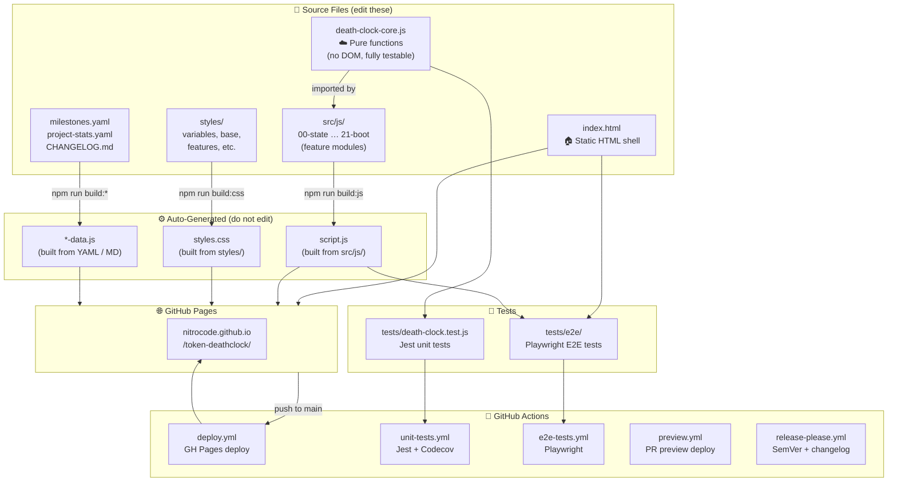

# 💀 AI Token Deathclock

[](https://github.com/nitrocode/token-deathclock/actions/workflows/unit-tests.yml)
[](https://github.com/nitrocode/token-deathclock/actions/workflows/e2e-tests.yml)
[](https://github.com/nitrocode/token-deathclock/actions/workflows/deploy.yml)
[](https://codecov.io/gh/nitrocode/token-deathclock)

> 🌐 **Live site:** [nitrocode.github.io/token-deathclock](https://nitrocode.github.io/token-deathclock/)

Every AI prompt has a cost. This site makes it visceral. 🔥

Watch the global AI token counter tick in real time, track environmental milestones as they fall, and discover what humanity could have done instead with those same resources.

Created by **RB**.

---

## ✨ Features

| Feature | Details |
|---------|---------|
| ⏱️ **Live counter** | Estimated global AI tokens consumed since Jan 2020, ticking in real-time |
| 📊 **Session counter** | Tokens consumed globally since *you* opened the page |
| 🌿 **Environmental milestones** | 7 thresholds (trees → bees → water → coral → glaciers → ocean → extinction) with progress bars and consequence descriptions |
| 📈 **Growth chart** | Historical data + 18-month projection on a log scale (Chart.js) |
| 🗓️ **Predictions table** | Predicted calendar dates for each upcoming milestone |
| 🏆 **Doom achievements** | Unlock badges as global consumption hits new levels |
| 🎮 **Accelerate the Doom** | A satirical mini-game — click to burn tokens faster |
| 🧮 **Personal footprint calculator** | Estimate your own AI token footprint |
| 🌙 **Dark / Light mode** | Toggle button; dark mode is the default |

---

## 🚀 Running Locally

```bash
# Clone the repo
git clone https://github.com/nitrocode/token-deathclock.git
cd token-deathclock

# Serve with any static server, e.g.:
npx serve .
# Then open http://localhost:3000
```

No build step required — it's a fully static site. 🎉

---

## 🧪 Running Tests

```bash
npm install
npm test          # runs Jest with coverage (interactive)
npm run test:ci   # CI mode — fails if coverage drops
npm run test:e2e  # Playwright end-to-end tests
```

Unit tests live in [`tests/death-clock.test.js`](tests/death-clock.test.js) and cover all pure functions in [`death-clock-core.js`](death-clock-core.js).

---

## 📊 Coverage

Unit-test coverage is tracked by [Codecov](https://codecov.io/gh/nitrocode/token-deathclock). Every pull request receives an automated comment showing per-file coverage deltas; the PR check fails if coverage decreases.

| Unit test coverage | Coverage breakdown |
|---|---|
| [](https://codecov.io/gh/nitrocode/token-deathclock) | [](https://codecov.io/gh/nitrocode/token-deathclock) |

E2E tests run in CI via Playwright (Chromium). Their pass/fail status is shown by the **E2E Tests** badge above.

---

## 🚢 Deployment

The site deploys automatically on every push to `main` via the [`deploy.yml`](.github/workflows/deploy.yml) workflow, pushing to the `gh-pages` branch.

🔗 Live URL: [https://nitrocode.github.io/token-deathclock/](https://nitrocode.github.io/token-deathclock/)

Pull requests each get an isolated preview URL:
`https://nitrocode.github.io/token-deathclock/previews/pr-{number}/`

---

## 🏗️ Architecture

### How it fits together



### Key source files

| File | Role |
|------|------|
| [`death-clock-core.js`](death-clock-core.js) | 🧠 Pure calculation functions — no DOM, fully unit-testable |
| [`src/js/`](src/js/) | 🖥️ Feature modules compiled into `script.js` |
| [`styles/`](styles/) | 🎨 CSS source files compiled into `styles.css` |
| [`index.html`](index.html) | 🏠 Static HTML shell loaded by GitHub Pages |
| [`milestones.yaml`](milestones.yaml) | 🏁 Source of truth for environmental milestone data |
| [`project-stats.yaml`](project-stats.yaml) | 📦 Tracks PR count + tokens consumed building this project |

> ⚠️ Never edit `script.js`, `styles.css`, or `*-data.js` directly — they are auto-generated. Edit the source files and run the relevant `npm run build:*` command.

---

## 🌍 Environmental Data Sources

| Metric | Source |
|--------|--------|
| Energy per token (~0.0003 kWh / 1K tokens) | Google/DeepMind inference benchmarks, MLPerf |
| CO₂ per kWh (0.4 kg) | [IEA global average grid intensity 2024](https://www.iea.org/data-and-statistics/charts/global-average-co2-intensity-of-electricity-generation-2000-2023) |
| Water per token (~0.5 L / 1K tokens) | [Microsoft sustainability report 2023](https://www.microsoft.com/en-us/corporate-responsibility/sustainability/report) |
| CO₂ per tree (~21 kg/year) | [US Forest Service estimates](https://www.fs.usda.gov/ccrc/topics/urban-forests/canopy-cover-and-carbon-sequestration) |
| Historical token growth | OpenAI usage blog, [Epoch AI](https://epochai.org/), [AI Index 2024](https://aiindex.stanford.edu/report/) |

> 📌 All figures are illustrative estimates intended to communicate scale, not precise measurements.

